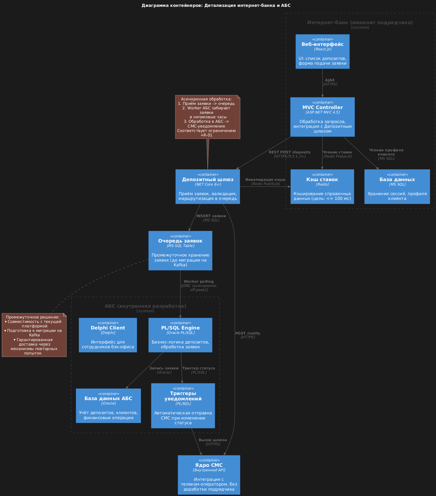

# Architecture Decision Record: Концептуальная архитектура открытия депозитов (MVP)

## ADR-001: Архитектура цифрового открытия депозитов для банка «Стандарт»

| Поле               | Значение                                                                                                                                                                              |
|--------------------|---------------------------------------------------------------------------------------------------------------------------------------------------------------------------------------|
| Статус             | Принято                                                                                                                                                                               |
| Дата               | 7 февраля 2026 г.                                                                                                                                                                     |
| Контекст           | Цифровая трансформация депозитного направления: реализация MVP для онлайн-подачи заявок на депозиты через сайт и интернет-банк с последующей ручной обработкой в бэк-офисе            |
| Проблемная область | Текущий процесс требует физического присутствия клиента в отделении (20–60 мин), ставки управляются в Excel, прямая интеграция интернет-банка с АБС невозможна из-за перегруженной БД |

### 1. Бизнес-требования и ограничения

#### Ключевые функциональные требования (MVP):
- F-01: Отображение актуальных ставок депозитов на сайте и в интернет-банке
- F-02: Персонализация ставок в интернет-банке для авторизованных клиентов
- F-03: Подача заявки через сайт (ФИО + телефон) → уведомление кол-центра
- F-04: Подача заявки через интернет-банк с СМС-подтверждением
- F-08: Отправка СМС-уведомлений о статусе заявки (без доработки подрядчика)

#### Критические ограничения:
- +R-01: Запрет прямых синхронных вызовов АБС из интернет-банка (БД перегружена)
- +R-02: АБС поддерживает только вертикальное масштабирование
- +R-04: Текущая версия интернет-банка несовместима с Kafka
- +R-05: Обязательное шифрование трафика (TLS 1.2+) для персональных данных
- +R-06: Запрет хранения ПДн новых клиентов до идентификации в отделении

#### Нефункциональные требования:
- Доступность 99.9% (24/7) с автоматическим переключением на резервный ЦОД
- Время отклика UI ≤ 100 мс, СМС-подтверждение ≤ 500 мс
- Горизонтальное масштабирование всех новых компонентов

### 2. Варианты архитектурных решений

| Вариант                                             | Описание                                                                       | Плюсы                                                                  | Минусы                                                                              | Оценка          |
|-----------------------------------------------------|--------------------------------------------------------------------------------|------------------------------------------------------------------------|-------------------------------------------------------------------------------------|-----------------|
| 1. Прямая интеграция с АБС                          | Интернет-банк напрямую вызывает API АБС для создания заявки                    | Минимум новых компонентов                                              | Нарушает +R-01, угроза стабильности АБС, невозможна горизонтальная масштабируемость | ❌ Неприемлемо   |
| 2. Единый монолитный шлюз                           | Создание единого сервиса-адаптера на .NET для интеграции с АБС                 | Единая точка управления, совместимость со стеком интернет-банка        | Станет точкой отказа, сложность масштабирования, блокирующие вызовы к АБС           | ⚠️ Рискованно   |
| 3. Асинхронная архитектура с промежуточной очередью | Введение сервиса «Депозитный шлюз» + очередь на базе БД (до миграции на Kafka) | Соответствует +R-01/04, отказоустойчивость, подготовка к микросервисам | Требует разработки нового компонента, асинхронность усложняет UX                    | ✅ Выбрано |

### 3. Принятое решение

#### Ключевые компоненты решения:
| Компонент          | Технология                               | Ответственность                                 | Особенности                                                          |
|--------------------|------------------------------------------|-------------------------------------------------|----------------------------------------------------------------------|
| Сервис ставок      | MS SQL (в составе АБС)                   | Хранение и актуализация ставок вместо Excel     | Доступ через защищённое API АБС, кэширование в Redis                 |
| Депозитный шлюз    | .NET Core 6+ (совместим с 4.5)           | Приём заявок, валидация, маршрутизация          | Stateless, горизонтальное масштабирование, поддержка Circuit Breaker |
| Очередь заявок     | Таблица в MS SQL с механизмом блокировок | Промежуточное хранение заявок до обработки АБС  | Временное решение до миграции интернет-банка на микросервисы + Kafka |
| Worker АБС         | PL/SQL + Delphi-адаптер                  | Асинхронная запись заявок в АБС в off-peak часы | Вертикальное масштабирование, ограничение RPS к БД АБС               |
| Сервис уведомлений | .NET Core + существующее ядро СМС        | Отправка статусов без доработки подрядчика      | Использование внутреннего API СМС-шлюза банка                        |

#### Критические архитектурные паттерны:
- Saga Pattern для управления распределёнными транзакциями (заявка → СМС → запись в АБС)
- Circuit Breaker для защиты от сбоев АБС
- Multi-level caching (Redis + CDN) для справочных данных (ставки) с целевым временем загрузки ≤ 100 мс
- Idempotency keys для операций СМС-подтверждения