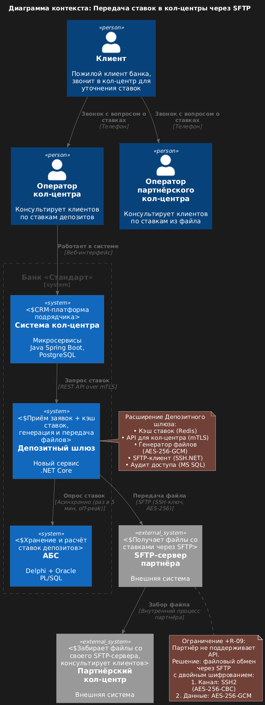
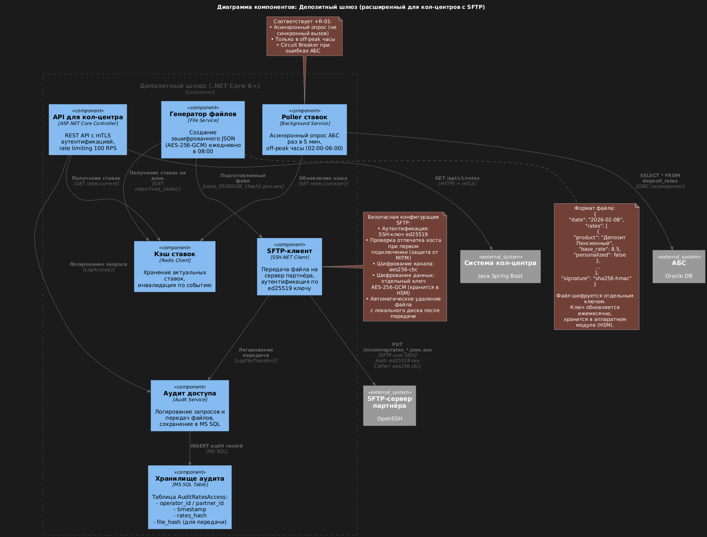

# Architecture Decision Record: Передача ставок депозитов в кол-центры через SFTP (расширение MVP)

## ADR-002: Интеграция справочника ставок с системами кол-центров с использованием SFTP для партнёрского обмена

| Поле               | Значение                                                                                                                                                                                                               |
|--------------------|------------------------------------------------------------------------------------------------------------------------------------------------------------------------------------------------------------------------|
| Статус             | Принято                                                                                                                                                                                                                |
| Дата               | 8 февраля 2026 г.                                                                                                                                                                                                      |
| Контекст           | Подготовка к маркетинговому запуску цифровых депозитов: обеспечение кол-центров актуальными ставками для консультации пожилых клиентов; передача ставок партнёрскому кол-центру через безопасный файловый обмен (SFTP) |
| Проблемная область | Риск перегрузки кол-центра звонками от пожилых клиентов; партнёрский кол-центр не поддерживает API-интеграцию, но готов получать файлы через SFTP                                                                      |

### 1. Уточнённые требования и ограничения

#### Ключевые функциональные требования:
- F-10: Предоставление актуальных ставок депозитов сотрудникам внутреннего кол-центра в реальном времени через REST API
- F-11: Ежедневная выгрузка ставок для партнёрского кол-центра в виде зашифрованного файла через SFTP
- F-12: Поддержка персонализированных ставок для клиентов с высоким балансом (для консультаций менеджеров)
- F-13: Аудит всех операций доступа к ставкам и передачи файлов партнёру

#### Критические ограничения (уточнённые):
- +R-01: Запрет прямых синхронных вызовов АБС
- +R-05: Обязательное шифрование персональных данных и коммерческой тайны (ставки)
- +R-09: Партнёрский кол-центр не поддерживает API-интеграцию, но готов принимать файлы через SFTP
- +R-10: Сотрудники кол-центров не должны иметь доступ к расчётной логике ставок (только к итоговым значениям)

#### Нефункциональные требования:
- R-06: Доступность справочника ставок для кол-центра 99.95%
- P-06: Время обновления ставок в кол-центре ≤ 5 минут после изменения в АБС
- P-07: Генерация и передача файла партнёру ≤ 2 минуты после фиксации ставок на день
- S-08: SFTP-сервер должен соответствовать требованиям ЦБ РФ по защите коммерческой тайны (аутентификация по ключам, шифрование трафика)

### 2. Принятое решение: Расширенный Депозитный шлюз с SFTP-клиентом
Расширить Депозитный шлюз для работы со ставками:

### 3. Use Cases и покрытие требованиями

| Use Case                                | Актор                 | Сценарий                                                                                                                                                                                  | Требования  | Нефункциональные аспекты                                  |
|-----------------------------------------|-----------------------|-------------------------------------------------------------------------------------------------------------------------------------------------------------------------------------------|-------------|-----------------------------------------------------------|
| UC-10: Консультация клиента по ставкам  | Оператор кол-центра   | 1. Открывает карточку клиента в системе кол-центра 2. Система запрашивает ставки из Депозитного шлюза через REST API 3. Отображает актуальные и персонализированные ставки          | F-10, F-12  | Время ответа ≤ 200 мс (P-06), mTLS аутентификация (+R-05) |
| UC-11: Ежедневная выгрузка для партнёра | Система (планировщик) | 1. В 08:00 система фиксирует ставки на день 2. Генерирует зашифрованный JSON-файл 3. Передаёт файл на SFTP-сервер партнёра через SSH-ключ                                           | F-11, +R-09 | Двойное шифрование (канал + данные), аудит передачи       |
| UC-12: Обработка файла партнёром        | Система партнёра      | 1. Автоматический скрипт партнёра забирает новый файл с их SFTP-сервера каждые 15 минут 2. Расшифровывает содержимое своим ключом 3. Загружает ставки в локальную БД для операторов | F-11        | Согласование формата и ключей шифрования до запуска       |
| UC-13: Аудит передачи ставок            | Аудитор банка         | 1. Запрашивает отчёт по передаче файлов за период 2. Сверяет хеши переданных файлов с локальными копиями метаданных 3. Формирует отчёт для регулятора                               | F-13        | Сохранение метаданных (не содержимого файла) 3 года       |

### 4. Приоритизация задач для RoadMap

Ниже представлен детализированный план реализации с разбивкой по кварталам 2026 года, приоритетам и критичности для запуска маркетинговой кампании. План учитывает зависимости между командами и реалистичные сроки разработки с учётом текущей загрузки команд.

#### Легенда приоритизации:

| Приоритет | Описание                                             | Критичность для запуска          |
|-----------|------------------------------------------------------|----------------------------------|
| P0        | Критически важные задачи — без них запуск невозможен | Обязательно для MVP              |
| P1        | Важные для стабильности и базовой безопасности       | Рекомендуется до запуска         |
| P2        | Улучшения операционной эффективности и мониторинга   | Можно отложить на пост-MVP       |
| P3        | Оптимизации и автоматизация (фаза 2)                 | Плановая доработка после запуска |

#### Критический путь (обязательные задачи для запуска маркетинговой кампании)

| Квартал           | Приоритет | Задача                                                                                      | Ответственная команда            | Сроки    | Зависимости                | Комментарий                                                   |
|-------------------|-----------|---------------------------------------------------------------------------------------------|----------------------------------|----------|----------------------------|---------------------------------------------------------------|
| Q1 2026 (фев–апр) | P0        | Создание материализованного представления ставок в АБС (только чтение)                      | Команда АБС (20 чел.)            | 2 недели | —                          | Минимизация нагрузки на БД АБС при опросе                     |
| Q1 2026           | P0        | Реализация Background Service для асинхронного опроса ставок из АБС (раз в 5 мин, off-peak) | Цифровая трансформация (10 чел.) | 3 недели | Завершение задачи АБС выше | Соответствие ограничению +R-01                                |
| Q1 2026           | P0        | Реализация кэша ставок на Redis с базовым шифрованием (AES-128)                             | Цифровая трансформация           | 2 недели | Опрос ставок из АБС        | Время отклика ≤ 100 мс (требование P-02)                      |
| Q1 2026           | P0        | Разработка REST API для кол-центра с аутентификацией по API-ключу                           | Цифровая трансформация           | 2 недели | Кэш ставок                 | Минимальная реализация вместо mTLS для ускорения              |
| Q1 2026           | P0        | Интеграция системы кол-центра с новым API (адаптер на стороне подрядчика)                   | Кол-центр + подрядчик (5 чел.)   | 3 недели | Готовность API             | Тестирование в песочнице с моками                             |
| Q1 2026           | P0        | Настройка SFTP-сервера у партнёра и обмен публичными SSH-ключами (ed25519)                  | Бизнес-команда + ИБ              | 2 недели | —                          | Передача ключей через защищённый канал (не электронная почта) |
| Q1 2026           | P0        | Реализация генератора файлов (простой JSON без шифрования содержимого)                      | Цифровая трансформация           | 2 недели | Кэш ставок                 | Минимальная реализация для быстрого запуска                   |
| Q1 2026           | P0        | Интеграция SFTP-клиента (библиотека SSH.NET) с базовой обработкой ошибок                    | Цифровая трансформация           | 2 недели | Генератор файлов           | Передача файла ежедневно в 08:00                              |
| Q2 2026 (май–июн) | P0        | Интеграционное тестирование полного цикла: АБС → Шлюз → Кол-центр → Партнёр                 | Цифровая трансформация + ИБ      | 2 недели | Все задачи Q1              | Тестирование с реальным SFTP-сервером партнёра                |
| Q2 2026           | P0        | Обучение операторов кол-центра работе с новым функционалом                                  | Кол-центр (200 чел.)             | 1 неделя | Тестирование               | Проведение тренингов до запуска кампании                      |
| Q2 2026           | P0        | Пилотный запуск с 10% трафика и мониторинг стабильности                                     | Цифровая трансформация           | 2 недели | Обучение операторов        | Постепенное увеличение нагрузки                               |
| Q2 2026           | P0        | Полноценный запуск маркетинговой кампании с поддержкой кол-центров                          | Бизнес-команда                   | 1 неделя | Пилотный запуск            | Старт продвижения цифровых депозитов                          |

> Итог критического пути: Запуск маркетинговой кампании возможен к концу Q2 2026 при условии выполнения всех P0-задач. Минимальная реализация (без двойного шифрования и HSM) снижает время вывода на рынок на 6–8 недель.

#### Дополнительные улучшения (рекомендуемые к реализации после запуска)

| Квартал              | Приоритет | Задача                                                                                             | Ответственная команда       | Сроки    | Зависимости              | Комментарий                                       |
|----------------------|-----------|----------------------------------------------------------------------------------------------------|-----------------------------|----------|--------------------------|---------------------------------------------------|
| Q1 2026              | P1        | Базовый аудит доступа к ставкам (логирование запросов в файл)                                      | Цифровая трансформация      | 1 неделя | REST API                 | Минимальный аудит для соответствия требованиям ЦБ |
| Q2 2026              | P1        | Добавление rate limiting (100 RPS) к API кол-центра                                                | Цифровая трансформация      | 1 неделя | —                        | Защита от случайной перегрузки                    |
| Q2 2026              | P1        | Шифрование содержимого файла (AES-256-GCM) + хранение ключа в защищённом хранилище                 | Цифровая трансформация + ИБ | 3 недели | Генератор файлов         | Повышение защиты коммерческой тайны               |
| Q2 2026              | P1        | Механизм повторных попыток передачи через SFTP (экспоненциальная задержка)                         | Цифровая трансформация      | 1 неделя | SFTP-клиент              | Повышение отказоустойчивости                      |
| Q2 2026              | P1        | Аудит передачи файлов (сохранение хеша файла в БД)                                                 | Цифровая трансформация      | 1 неделя | Шифрование файла         | Соответствие требованию F-13                      |
| Q3 2026 (июл–сен) | P2        | Миграция аутентификации API с ключей на mTLS                                                       | Цифровая трансформация + ИБ | 3 недели | —                        | Повышение безопасности внутренних интеграций      |
| Q3 2026              | P2        | Интеграция с системой мониторинга (метрики: время опроса АБС, количество запросов кол-центра)      | Цифровая трансформация      | 2 недели | —                        | Операционная эффективность                        |
| Q3 2026              | P2        | Настройка алертинга при превышении порогов (отказы SFTP > 5%, задержка обновления ставок > 10 мин) | Цифровая трансформация      | 1 неделя | Мониторинг               | Снижение времени реакции на инциденты             |
| Q3 2026              | P2        | Автоматизация ротации SSH-ключей (ежемесячная замена)                                              | ИБ + Цифровая трансформация | 4 недели | —                        | Снижение операционной нагрузки                    |
| Q3 2026              | P3        | Выделение «Сервиса ставок» как отдельного микросервиса (разделение ответственностей)               | Цифровая трансформация      | 6 недель | —                        | Погашение технического долга, подготовка к фазе 2 |
| Q3 2026              | P3        | Интеграция с HSM для хранения ключей шифрования                                                    | ИБ                          | 4 недели | Выделение сервиса ставок | Максимальная защита ключей                        |

### 5. Ссылки на требования из расширенной FURPS+

| Код        | Требование                       | Реализация в архитектуре                                                      |
|------------|----------------------------------|-------------------------------------------------------------------------------|
| F-10, F-12 | Доступ кол-центра к ставкам      | REST API Депозитного шлюза с mTLS и кэшированием                              |
| F-11       | Выгрузка для партнёра через SFTP | Генератор файлов + SFTP-клиент (SSH.NET) с двойным шифрованием                |
| +R-01      | Асинхронность с АБС              | Polling в off-peak часы вместо синхронных вызовов                             |
| +R-05      | Шифрование коммерческой тайны    | Тройная защита: шифрование в кэше + шифрование файла + шифрование канала SFTP |
| +R-09      | Файловый обмен вместо API        | SFTP как стандартный протокол для передачи файлов (не как транспорт для API)  |
| R-06       | Доступность 99.95%               | Резервирование инстансов шлюза + кэширование в Redis                          |
| P-06       | Актуальность ≤ 5 мин             | Расписание опроса АБС раз в 5 минут                                           |
| S-08       | Требования ЦБ РФ к SFTP          | Аутентификация по ключам (не пароль), шифрование AES-256, аудит всех операций |

### 6. Критические риски и митигация

| Риск                                            | Вероятность | Воздействие | Митигация                                                                                                            |
|-------------------------------------------------|-------------|-------------|----------------------------------------------------------------------------------------------------------------------|
| Компрометация SSH-ключа партнёра                | Низкая      | Высокое     | Ежемесячная ротация ключей; мониторинг необычных подключений; автоматический отзыв при подозрении                    |
| Утечка ключа шифрования данных файла            | Средняя     | Критическое | Хранение ключа в HSM; разделение обязанностей (ключ ≠ учётная запись для SFTP); аудит всех операций с ключом         |
| Отказ SFTP-сервера партнёра                     | Средняя     | Среднее     | Механизм повторных попыток (до 5 раз с экспоненциальной задержкой); уведомление ответственного при постоянном отказе |
| Несоответствие формата файла ожиданиям партнёра | Высокая     | Низкое      | Совместное тестирование формата на тестовом окружении до запуска; обратная совместимость версий                      |

### 7. Матрица загрузки команд по кварталам

| Команда                | Q1 2026                                                    | Q2 2026                                                                  | Q3 2026                                                       | Комментарий                                                                                   |
|------------------------|------------------------------------------------------------|--------------------------------------------------------------------------|---------------------------------------------------------------|-----------------------------------------------------------------------------------------------|
| Цифровая трансформация | 🔴 Высокая (8 недель разработки + 2 недели тестирование)   | 🟠 Средняя (3 недели доработки + 2 недели тестирование + 2 недели пилот) | 🟢 Низкая (6 недель выделения сервиса + 3 недели мониторинга) | Ключевая команда проекта; требуется резерв 20% мощности на непредвиденные задачи              |
| АБС                    | 🟢 Низкая (2 недели на матвью + согласования)              | 🟢 Низкая (мониторинг нагрузки)                                          | 🟢 Низкая (мониторинг)                                        | Минимальная загрузка благодаря асинхронному подходу (+R-01)                                   |
| Кол-центр (подрядчик)  | 🟠 Средняя (3 недели интеграции + 1 неделя тестирование)   | 🔴 Высокая (1 неделя обучения 200 операторов)                            | 🟢 Низкая (поддержка)                                         | Зависимость от готовности API; требуется раннее вовлечение подрядчика                         |
| Интернет-банк          | 🟢 Низкая (только согласование формата ставок)             | 🟠 Средняя (2 недели пилотного запуска)                                  | 🟢 Низкая                                                     | Минимальная загрузка, так как ставки уже отображаются в интернет-банке (из основного решения) |
| ИБ                     | 🟠 Средняя (2 недели на обмен ключами с партнёром)         | 🟠 Средняя (3 недели шифрования + 1 неделя аудита)                       | 🔴 Высокая (4 недели ротации ключей + 4 недели HSM)           | Критически важна для соответствия требованиям ЦБ РФ                                           |
| Бизнес (депозиты)      | 🟠 Средняя (согласование структуры ставок + обмен ключами) | 🔴 Высокая (обучение операторов + запуск кампании)                       | 🟢 Низкая                                                     | Владелец процесса; требуется участие на всех этапах                                           |
| Партнёрский кол-центр  | 🟠 Средняя (настройка SFTP-сервера + тестирование)         | 🟢 Низкая (приём файлов)                                                 | 🟢 Низкая                                                     | Внешняя зависимость; требуется еженедельный контроль менеджером проекта                       |

### 8.Ключевые выводы по загрузке команд

1. Цифровая трансформация — ключевая команда проекта:
- Максимальная загрузка в Q1 (8 недель разработки)
- Требуется резерв 20% мощности на непредвиденные задачи
- В Q3 фокус смещается на погашение техдолга (выделение сервиса ставок)

2. АБС — минимальная загрузка благодаря архитектурному решению:
- Всего 2 недели в Q1 на создание матвью
- Дальнейшая работа — только мониторинг нагрузки
- Соответствует ограничению +R-01 (запрет синхронных вызовов)

3. Кол-центр (подрядчик) — критическая внешняя зависимость:
- Интеграция в Q1 требует раннего вовлечения (с февраля)
- Обучение 200 операторов в Q2 — узкое место по срокам
- Рекомендуется включить штрафные санкции в договор на случай задержек

4. Информационная безопасность — постепенный рост загрузки:
- Минимум в Q1 (обмен ключами)
- Пик в Q3 (HSM, ротация ключей)
- Требуется раннее согласование требований ЦБ РФ

5. Бизнес (депозиты) — владелец процесса:
- Участие на всех этапах: от проектирования до запуска кампании
- Критически важна для согласования формата ставок и обучения операторов
- Данный план обеспечивает запуск маркетинговой кампании к концу Q2 2026 с чётким распределением ответственности между командами и учётом их реальных возможностей и ограничений. Все задачи критического пути (P0) реализуемы в указанные сроки при текущей загрузке команд.