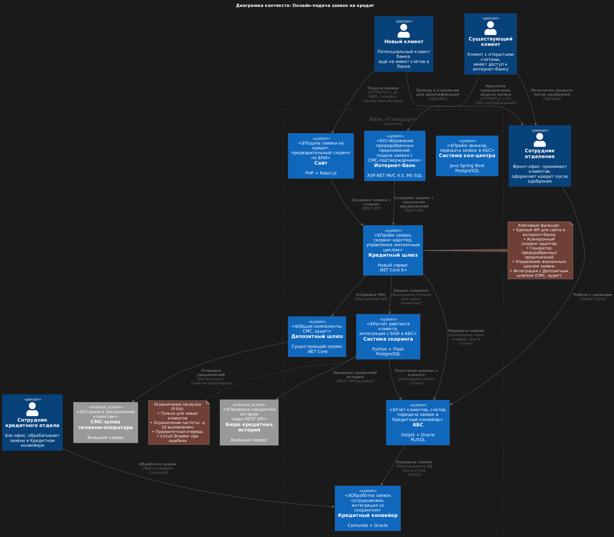
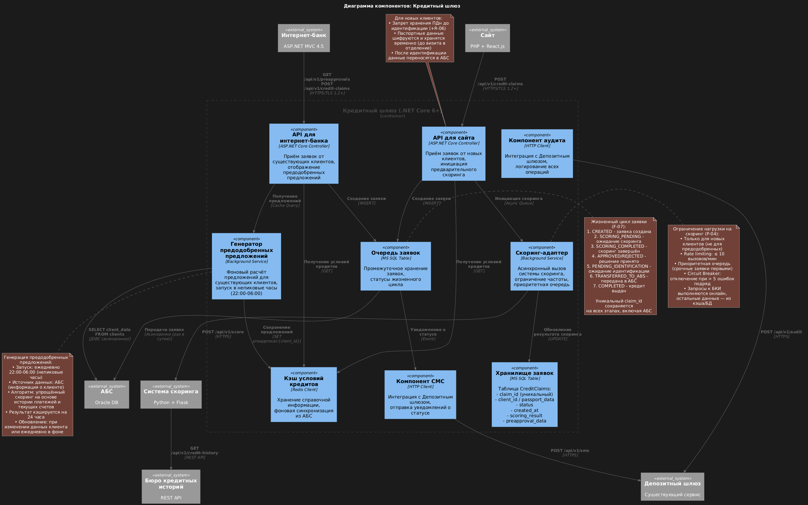

# Architecture Decision Record: Онлайн-подача заявок на кредит (расширение цифровой трансформации)

## ADR-003: Архитектура цифрового кредитования для банка «Стандарт»

| Поле               | Значение                                                                                                                                                                                                                                                      |
|--------------------|---------------------------------------------------------------------------------------------------------------------------------------------------------------------------------------------------------------------------------------------------------------|
| Статус             | Принято                                                                                                                                                                                                                                                       |
| Дата               | 8 февраля 2026 г.                                                                                                                                                                                                                                             |
| Контекст           | Расширение цифровых каналов банка на кредитное направление: реализация онлайн-подачи заявок на кредит через сайт и интернет-банк с ускоренной обработкой предодобренных заявок                                                                                |
| Проблемная область | Текущий процесс требует физического присутствия в отделении (20–60 мин); обмен между АБС и Кредитным конвейером раз в сутки (+R-03); система скоринга перегружена в пиковые часы (+ нагрузка); новые клиенты не могут получить предварительное решение онлайн |

### 1. Бизнес-требования и ограничения

#### Ключевые функциональные требования:
- F-05: Подача заявки на кредит через сайт с возможностью предварительного скоринга по БКИ (для новых клиентов)
- F-06: Отображение предодобренных кредитных предложений в интернет-банке (для существующих клиентов)
- F-07: Единый жизненный цикл заявки (сайт → отделение → АБС) с уникальным идентификатором
- F-04: Подача заявки через интернет-банк с СМС-подтверждением
- F-08: Отправка СМС-уведомлений об изменении статуса заявки (без доработки подрядчика)
- F-09: Обязательная идентификация новых клиентов в отделении перед выдачей кредита

#### Критические ограничения:
- +R-01: Запрет прямых синхронных вызовов АБС (БД перегружена)
- +R-03: Обмен данными между АБС и Кредитным конвейером возможен только раз в сутки
- +R-04: Версия платформы интернет-банка несовместима с современными очередями (Kafka)
- +R-05: Обязательное шифрование всех каналов передачи персональных данных (TLS 1.2+)
- +R-06: Запрет хранения персональных данных новых клиентов до идентификации в отделении
- +R-07: Наличие внутренней экспертизы по используемым технологиям
- +R-08: Совместимость с существующими платформами разработки

#### Нефункциональные требования:
- R-01: Доступность сервисов 99.9% (24/7) с автоматическим переключением на резервный ЦОД
- R-02: Отказоустойчивость интернет-банка при недоступности АБС
- R-03: Гарантированная доставка СМС-уведомлений даже при временных сбоях
- P-01: Время обработки операции подтверждения СМС ≤ 500 мс
- P-02: Загрузка справочных данных (условия кредитов) ≤ 100 мс
- P-04: Минимизация нагрузки на систему скоринга (запрет предрасчётов в пиковую нагрузку)
- S-04: Микросервисная архитектура для новых компонентов с чёткими границами

### 2. Варианты архитектурных решений

| Вариант                                     | Описание                                                                                       | Плюсы                                                                                                                            | Минусы                                                                                                                            | Оценка                       |
|---------------------------------------------|------------------------------------------------------------------------------------------------|----------------------------------------------------------------------------------------------------------------------------------|-----------------------------------------------------------------------------------------------------------------------------------|------------------------------|
| 1. Прямая интеграция с Кредитным конвейером | Интернет-банк/сайт напрямую вызывают Кредитный конвейер для обработки заявок                   | Минимальная задержка обработки, прямой контроль над процессом                                                                    | Нарушает +R-03 (обмен раз в сутки), создаёт дополнительную нагрузку на Кредитный конвейер, усложняет единый жизненный цикл заявки | ❌ Неприемлемо                |
| 2. Расширение Депозитного шлюза             | Добавление в существующий Депозитный шлюз компонентов для обработки кредитных заявок           | Повторное использование архитектуры, минимизация новых сервисов, единая точка интеграции                                         | Риск превращения шлюза в «божественный объект», смешение доменных ответственностей (депозиты ≠ кредиты)                           | ⚠️ Приемлемо с ограничениями |
| 3. Отдельный Кредитный шлюз                 | Создание нового микросервиса «Кредитный шлюз» с чёткими границами для кредитного домена        | Чистая архитектура, изоляция нагрузки, соответствие принципу единственной ответственности                                        | Требует дополнительных ресурсов на разработку и эксплуатацию                                                                      | ✅ Рекомендуется              |
| 4. Гибридное решение (выбрано)              | Создание Кредитного шлюза + интеграция с Депозитным шлюзом" для общих компонентов (СМС/аудит)" | Баланс архитектурной чистоты и повторного использования, соответствие ограничению +R-04, подготовка к микросервисной архитектуре | Требует чёткого определения границ между шлюзами                                                                                  | ✅ Принято                    |

### 3. Принятое решение: Кредитный шлюз с асинхронной интеграцией

#### Создать новый микросервис «Кредитный шлюз» с интеграцией существующих систем:

#### Ключевые компоненты решения:

| Компонент                            | Технология                     | Ответственность                                                               | Особенности                                                                    |
|--------------------------------------|--------------------------------|-------------------------------------------------------------------------------|--------------------------------------------------------------------------------|
| API для сайта                        | ASP.NET Core Controller        | Приём заявок от новых клиентов, предварительный скоринг по БКИ                | Аутентификация по API-ключу, rate limiting 50 RPS                              |
| API для интернет-банка               | ASP.NET Core Controller        | Приём заявок от существующих клиентов, отображение предодобренных предложений | Аутентификация по сессии интернет-банка, кэширование предложений               |
| Очередь заявок                       | MS SQL Table                   | Промежуточное хранение заявок до передачи в АБС/Кредитный конвейер            | Гарантированная доставка, статусы жизненного цикла                             |
| Кэш условий кредитов                 | Redis                          | Хранение справочной информации об условиях кредитов                           | Фоновая синхронизация из АБС, время отклика ≤ 100 мс                           |
| Скоринг-адаптер                      | Background Service             | Асинхронный вызов системы скоринга только для новых клиентов                  | Ограничение частоты вызовов (не более 10 в минуту в пик), приоритетная очередь |
| Генератор предодобренных предложений | Background Service             | Фоновый расчёт предодобренных предложений для существующих клиентов           | Запуск в непиковые часы (22:00–06:00), кэширование результатов                 |
| Компонент СМС                        | Интеграция с Депозитным шлюзом | Отправка уведомлений о статусе заявки                                         | Повторное использование существующего механизма, минимизация дублирования      |
| Аудит операций                       | Интеграция с Депозитным шлюзом | Логирование всех операций с заявками                                          | Единая точка аудита для депозитов и кредитов                                   |

#### Критические архитектурные паттерны:
- API Gateway Pattern для единообразного доступа из сайта и интернет-банка
- CQRS Pattern для разделения операций чтения (предодобренные предложения) и записи (подача заявки)
- Saga Pattern для управления распределёнными транзакциями (заявка → скоринг → СМС → запись в АБС)
- Circuit Breaker для защиты от сбоев системы скоринга и БКИ
- Event Sourcing для отслеживания жизненного цикла заявки с уникальным идентификатором
- Strangler Fig Pattern — постепенная миграция с синхронной обработки на асинхронную

### 4. Use Cases

| Use Case                                                        | Актор                              | Сценарий                                                                                                                                                                                                                                                                                        | Требования         | Нефункциональные аспекты                                                                    |
|-----------------------------------------------------------------|------------------------------------|-------------------------------------------------------------------------------------------------------------------------------------------------------------------------------------------------------------------------------------------------------------------------------------------------|--------------------|---------------------------------------------------------------------------------------------|
| **UC-20**: Предварительный скоринг нового клиента на сайте      | Новый клиент                       | 1. Клиент заполняет форму на сайте (ФИО, телефон, паспортные данные) 2. Система шифрует ПДн и сохраняет временно 3. Инициируется запрос к системе скоринга через БКИ 4. Клиент получает предварительное решение (одобрено/отклонено) 5. Отправляется СМС с приглашением в отделение | F-05, +R-05, +R-06 | Шифрование ПДн (TLS 1.2+), ограничение нагрузки на скоринг (≤ 10/мин), время ответа ≤ 2 сек |
| **UC-21**: Просмотр предодобренных предложений в интернет-банке | Существующий клиент                | 1. Клиент заходит в интернет-банк 2. Система проверяет кэш предодобренных предложений 3. Отображается персонализированное предложение с суммой и ставкой 4. Клиент может сразу подать заявку                                                                                           | F-06, P-02         | Время загрузки ≤ 100 мс (кэширование), актуальность данных ≤ 24 часа                        |
| **UC-22**: Подача заявки на кредит через интернет-банк          | Существующий клиент                | 1. Клиент выбирает предодобренное предложение или стандартный кредит 2. Заполняет форму (счёт зачисления, сумма) 3. Подтверждает операцию СМС-кодом 4. Заявка сохраняется в очереди Кредитного шлюза                                                                                   | F-04, F-07         | Время СМС-подтверждения ≤ 500 мс (P-01), идемпотентность операции                           |
| **UC-23**: Обработка заявки сотрудником кредитного отдела       | Сотрудник кредитного отдела        | 1. Заявка передаётся из АБС в Кредитный конвейер (раз в сутки) 2. Сотрудник открывает заявку в интерфейсе Camunda 3. Проводится дополнительная проверка при необходимости 4. Принимается решение (одобрить/отклонить) 5. Статус обновляется в системе                               | +R-03, F-08        | Гарантированная доставка заявок, аудит всех действий сотрудника                             |
| **UC-24**: Уведомление клиента о статусе заявки                 | Система                            | 1. При изменении статуса заявки генерируется событие 2. Кредитный шлюз вызывает СМС-компонент Депозитного шлюза 3. Отправляется СМС клиенту с текущим статусом 4. Статус отображается в интернет-банке (для существующих клиентов)                                                     | F-08, R-03         | Гарантированная доставка СМС, повторные попытки при ошибках                                 |
| **UC-25**: Идентификация нового клиента в отделении             | Сотрудник отделения + новый клиент | 1. Клиент приходит в отделение с паспортом 2. Сотрудник находит заявку по уникальному claim_id 3. Проводится верификация личности 4. ПДн сохраняются в АБС 5. Клиент получает окончательное решение по кредиту                                                                      | F-07, F-09         | Сохранность данных при сбоях (R-04), уникальный идентификатор заявки                        |

### 5. Ограничения принятого решения

#### Архитектурные ограничения:

1. Асинхронность с АБС и Кредитным конвейером (+R-01, +R-03)
- Заявки передаются в АБС только раз в сутки, что создаёт задержку между подачей онлайн и началом обработки сотрудником
- Митигация: Отображение клиенту ожидаемого времени обработки; приоритизация предодобренных заявок
2. Ограничение нагрузки на систему скоринга (P-04)
- Предварительный скоринг доступен только для новых клиентов; для существующих клиентов используются кэшированные предодобренные предложения
- Частота вызовов ограничена 10 в минуту, что может создавать очередь в пиковые часы
- Митигация: Приоритетная очередь для срочных заявок; кэширование результатов скоринга на 24 часа
3. Несовместимость интернет-банка с современными очередями (+R-04)
- Использование БД (MS SQL) как промежуточной очереди вместо Kafka
- Митигация: Чёткий план миграции на микросервисную архитектуру и Kafka в фазе 2 (через 12 месяцев)
4. Запрет хранения ПДн новых клиентов до идентификации (+R-06)
- Паспортные данные новых клиентов шифруются и хранятся временно (до визита в отделение)
- После идентификации данные переносятся в АБС, временные данные удаляются
- Митигация: Автоматическая очистка данных через 7 дней без идентификации; аудит всех операций с ПДн

#### Технические ограничения:
5. Зависимость от внешних систем (БКИ, СМС-шлюз)
- Сбои в работе Бюро кредитных историй или телеком-оператора влияют на процесс кредитования
- Митигация: Circuit Breaker для внешних вызовов; кэширование данных БКИ на 24 часа при доступности
6. Ограниченная экспертиза в новых технологиях (+R-07)
- Команда имеет опыт в .NET и Java, но ограниченную экспертизу в event-driven архитектуре
- Митигация: Использование знакомых технологий (MS SQL, Redis); постепенное внедрение новых паттернов
7. Вертикальное масштабирование АБС (+R-02)
АБС не может горизонтально масштабироваться, что ограничивает общую пропускную способность системы
Митигация: Минимизация обращений к АБС через кэширование и асинхронную обработку

#### Бизнес-ограничения:
8. Обязательная идентификация в отделении (F-09)
- Новые клиенты не могут полностью завершить процесс онлайн — требуется визит в отделение
- Митигация: Упрощение процесса идентификации; предварительное заполнение данных онлайн
9. Различные процессы для новых и существующих клиентов
- Новые клиенты проходят полный скоринг через БКИ; существующие — получают предодобренные предложения
- Митигация: Единый интерфейс подачи заявки с адаптивной логикой обработки

### 6. Заключение
Принятое решение обеспечивает реализацию онлайн-кредитования с учётом всех архитектурных ограничений банка «Стандарт». Ключевые преимущества:
- ✅ **Соответствие ограничениям**: Асинхронная интеграция с АБС (+R-01, +R-03), использование знакомых технологий (+R-07, +R-08)
- ✅ **Масштабируемость**: Микросервисная архитектура Кредитного шлюза, горизонтальное масштабирование всех новых компонентов
- ✅ **Безопасность**: Шифрование ПДн (+R-05), временно хранение данных новых клиентов (+R-06), аудит всех операций
- ✅ **Повторное использование**: Интеграция с Депозитным шлюзом для СМС и аудита, минимизация дублирования кода
- ✅ **Подготовка к будущему**: Чёткий план миграции на Kafka и микросервисную архитектуру интернет-банка в фазе 2
- **Технический долг**: Использование БД как очереди вместо Kafka — осознанный компромисс для ускорения вывода на рынок. План погашения задокументирован в разделе «План реализации».

Данная архитектура позволяет запустить онлайн-кредитование в течение 10 месяцев с минимальными рисками для стабильности существующих систем и обеспечивает основу для дальнейшей автоматизации кредитных процессов.
